<p align="center">
  
</p>

<h1 align="center">InfoMesh</h1>
<p align="center">
  <strong>Fully Decentralized P2P Search Engine for LLMs</strong><br>
  <em>No credit card. No API key. No usage cap. Forever free.</em>
</p>

<p align="center">
  
  
  
  
</p>

<p align="center">
  <a href="https://github.com/dotnetpower/infomesh/actions"></a>
  <a href="https://pypi.org/project/infomesh/"></a>
  <a href="LICENSE"></a>
  <a href="https://www.python.org/"></a>
  <a href="https://github.com/dotnetpower/infomesh/stargazers"></a>
</p>

<p align="center">
  <a href="https://github.com/dotnetpower/infomesh/issues"></a>
  <a href="https://github.com/dotnetpower/infomesh/pulls"></a>
  <a href="https://github.com/dotnetpower/infomesh/commits/main"></a>
  <a href="https://github.com/dotnetpower/infomesh"></a>
  <a href="https://modelcontextprotocol.io/"></a>
</p>

<p align="center">
  <a href="#-quick-start">Quick Start</a> •
  <a href="#-why-infomesh">Why InfoMesh</a> •
  <a href="#-features">Features</a> •
  <a href="#-architecture">Architecture</a> •
  <a href="#-security--trust">Security</a> •
  <a href="#-enterprise-readiness">Enterprise</a> •
  <a href="#-earning-credits">Credits</a> •
  <a href="#-contributing">Contributing</a> •
  <a href="#-documentation">Docs</a>
</p>

---

## 💡 Why InfoMesh?

### The Problem

Every AI assistant needs real-time web access — but that access is gated behind expensive, proprietary search APIs:

| Type | Typical Cost | Limitation |
|------|-------------|------------|
| LLM-bundled web search | Hidden in token cost | Locked to one vendor's API, no standalone access |
| Custom search API | ~$3–5 / 1,000 queries | API key + billing account required, rate-limited |
| AI search SaaS | ~$0.01–0.05 / query | SaaS dependency, monthly usage caps |
| Search scraping proxy | ~$50+/month | Fragile, breaks on upstream changes |
| **InfoMesh** | **$0 — Forever Free** | **None. You own the node, you own the index** |

This creates a **paywall barrier** for independent AI developers, open-source assistants, and researchers. Small projects and local LLMs simply cannot afford real-time web search.

### The Solution

I started building AI agents and quickly hit a wall: **there was no free web search API.**
Every provider wanted a credit card, a billing account, or a monthly subscription — just to let an AI agent look something up on the web. That felt wrong.

So I built InfoMesh — a decentralized search engine where the community *is* the infrastructure:

- **No central server** — every participant is both a crawler and a search node.
- **No per-query cost** — contribute crawling, earn search credits. The more you give, the more you can search.
- **No vendor lock-in** — standard MCP protocol integration, works offline with your local index.
- **No data harvesting** — search queries never leave your node. There is no central entity to collect them.

InfoMesh does **not** compete with existing commercial search providers. Those companies serve *human* search at massive scale with ads-based monetization. InfoMesh provides *minimal, sufficient* search capabilities for AI assistants — for free, via [MCP](https://modelcontextprotocol.io/) — **democratizing real-time web access without per-query billing.**

> _I just wanted my AI agent to search the web without reaching for my wallet. If you've felt the same way, InfoMesh is for you._

### 🆓 Free. Every Interface. No Exceptions.

| How you use it | Cost | Example |
|---------------|------|--------|
| **MCP** (AI assistants) | **Free** | Claude, VS Code Copilot, any MCP client calls `search()` — zero API fees |
| **CLI** (terminal) | **Free** | `uv run infomesh search "python asyncio"` — instant results from your index |
| **Python package** (code) | **Free** | `from infomesh.index.local_store import LocalStore` — embed search in your app |
| **Local API** (HTTP) | **Free** | `curl localhost:8080/search?q=...` — REST endpoint for any language |

No API keys. No billing accounts. No usage caps. No rate limits per dollar.
You run a node, you contribute to the network, and **search is free — forever.**

---

## 🔐 Safe by Design — The Most Secure Search Engine You Can Run

Most search engines ask you to trust *them*. InfoMesh asks you to trust *math*.

There is no central server that collects your queries. There is no company that stores your search history. There is no database of user behavior waiting to be breached. **Your data never leaves your machine unless you choose to share it.**

> Contribute to the network → earn credits → search for free, forever, with no limits.

That's the entire deal. No catch.

### Why InfoMesh Is Enterprise-Grade Secure

<table>
<tr><td>🔑</td><td><strong>Ed25519 Cryptographic Identity</strong></td><td>Every node generates a unique Ed25519 key pair on first launch. All actions — crawling, indexing, credit transactions — are cryptographically signed. No one can impersonate your node. Key rotation is supported via <code>infomesh keys rotate</code> with dual-signed DHT revocation.</td></tr>
<tr><td>🔏</td><td><strong>Signed Content Attestation</strong></td><td>Every crawled page is fingerprinted with <code>SHA-256(raw_html)</code> + <code>SHA-256(extracted_text)</code>, then signed with the crawler's private key and published to the DHT. Tampering is mathematically detectable.</td></tr>
<tr><td>🌳</td><td><strong>Merkle Tree Integrity</strong></td><td>The entire index is secured by a Merkle Tree. Any node can request a membership proof for any document — if a single byte was altered, the proof fails. This is the same integrity model used by Git and blockchain.</td></tr>
<tr><td>🔍</td><td><strong>Random Audits</strong></td><td>~1 audit per hour per node. Three independent auditors re-crawl a random URL and compare <code>content_hash</code> against the original. Mismatch → trust penalty. 3 consecutive failures → network isolation.</td></tr>
<tr><td>🛡️</td><td><strong>Sybil Attack Defense</strong></td><td>Proof-of-Work node ID generation (~30 seconds on avg CPU) prevents mass fake-node creation. Additionally, max 3 nodes per /24 subnet per DHT bucket limits coordinated attacks.</td></tr>
<tr><td>🌐</td><td><strong>Eclipse Attack Defense</strong></td><td>≥3 independent bootstrap sources + routing table subnet diversity + periodic routing refresh. No single entity can surround your node with malicious peers.</td></tr>
<tr><td>🚫</td><td><strong>DHT Poisoning Defense</strong></td><td>Per-keyword publish rate limit (10/hr/node) + signed publications + content hash cross-verification. Injecting false search results is extremely difficult.</td></tr>
<tr><td>🔒</td><td><strong>Encrypted Transport</strong></td><td>All peer-to-peer communication runs through libp2p's Noise protocol — end-to-end encrypted. No eavesdropping on queries or results.</td></tr>
<tr><td>🕵️</td><td><strong>Zero Query Logging</strong></td><td>Search queries are processed locally or routed as hashed keywords through the DHT. No node — not even yours — records what other peers are searching for. There is no search history to subpoena.</td></tr>
<tr><td>🧮</td><td><strong>Credit Proof Verification</strong></td><td>Every credit entry is signed and includes a Merkle proof. Peers can independently verify credit claims without trusting the claimant. Farming detection + 24hr probation for new nodes prevent gaming.</td></tr>
</table>

### Unified Trust Score

Every peer earns a continuously updated trust score based on behavior, not identity:

```
Trust = 0.15 × uptime  +  0.25 × contribution  +  0.40 × audit_pass_rate  +  0.20 × summary_quality
```

| Tier | Score | What Happens |
|------|-------|-------------|
| 🟢 **Trusted** | ≥ 0.8 | Priority routing, lowest search cost |
| 🔵 **Normal** | 0.5 – 0.8 | Standard operation |
| 🟡 **Suspect** | 0.3 – 0.5 | Higher audit frequency, limited features |
| 🔴 **Untrusted** | < 0.3 | Network isolation after 3× consecutive failures |

### Compliance Built In

| Regulation | How InfoMesh Handles It |
|-----------|------------------------|
| **robots.txt** | Strictly enforced — no exceptions, automatic blocklist |
| **DMCA** | Signed takedown requests propagated via DHT, 24hr compliance |
| **GDPR** | Distributed deletion records, right-to-be-forgotten support |
| **Copyright** | Full text stored as cache only; search returns snippets with attribution |

> **Bottom line:** InfoMesh doesn't ask you to trust a company. It uses cryptography, audits, and game theory to make cheating harder than playing fair. Your queries are private, your data stays local, and your search is free — no strings attached.

---

## �🚀 Quick Start

Get up and running in under 2 minutes.

### Prerequisites

- **Python 3.12+**
- **[uv](https://docs.astral.sh/uv/)** — fast Python package manager (auto-creates virtualenv)

### Install & Run

```bash
# 1. Clone the repo
git clone https://github.com/dotnetpower/infomesh.git
cd infomesh

# 2. Install all dependencies (creates .venv automatically)
uv sync

# 3. Start InfoMesh — launches crawler, indexer, MCP server, and TUI dashboard
uv run infomesh start
```

That's it. InfoMesh will automatically:
- Generate your Ed25519 key pair (stored in `~/.infomesh/keys/`)
- Start crawling from curated seed URLs (tech docs, academic sources, encyclopedias)
- Build a local SQLite FTS5 search index
- Launch the Textual console dashboard with live stats
- Expose MCP tools for your AI assistant

### Headless Mode (Servers / CI)

```bash
uv run infomesh start --no-dashboard
```

### Docker

```bash
docker build -t infomesh .
docker run -d --name infomesh \
  -p 4001:4001 -p 8080:8080 \
  -v infomesh-data:/data \
  infomesh
```

### Verify It Works

```bash
# Search your local index
uv run infomesh search "python asyncio tutorial"

# Check node status
uv run infomesh status

# Crawl a specific URL on demand
uv run infomesh crawl https://docs.python.org/3/

# Export your index as a portable snapshot
uv run infomesh index export backup.zst
```

### Examples

Ready-to-run Python scripts are available in the [`examples/`](examples/) directory:

```bash
# Local search
uv run python examples/basic_search.py "python tutorial"

# Crawl → index → search pipeline
uv run python examples/crawl_and_search.py https://docs.python.org/3/

# Programmatic MCP client
uv run python examples/mcp_client.py "async programming"
```

See [examples/README.md](examples/README.md) for the full list.

---

## ✨ Features

### Core Capabilities

| Feature | Description |
|---------|-------------|
| 🌐 **Fully Decentralized** | No central server. Every node is both a hub and a participant — cooperative tit-for-tat architecture |
| 🤖 **LLM-First Design** | Pure text API via MCP, optimized for AI consumption. No browser UI needed |
| 🔍 **Dual Search** | Keyword search (SQLite FTS5 + BM25) and optional semantic vector search (ChromaDB) |
| 🕷️ **Smart Crawler** | Async crawling with robots.txt compliance, politeness delays, and 3-layer deduplication |
| 📡 **P2P Network** | libp2p-based with Kademlia DHT, mDNS local discovery, and encrypted transport |
| 💾 **Offline-Capable** | Your local index works without internet — search your crawled knowledge anytime |
| 🏆 **Credit Incentives** | Earn credits by crawling and serving peers. More contribution = more search quota |
| 🔐 **Content Integrity** | SHA-256 + Ed25519 attestation on every page. Random audits + Merkle proofs |
| 🤏 **zstd Compression** | Index snapshots and network transfers compressed with zstandard |
| 📊 **Console Dashboard** | Beautiful Textual TUI with 6 tabs: Overview, Crawl, Search, Network, Credits, Settings |

### MCP Integration — Free Web Search for AI Assistants

While OpenAI charges for `web_search_preview` and other providers bill per query,
InfoMesh exposes **5 MCP tools completely free** — no API key, no billing:

| Tool | Description |
|------|-------------|
| `search(query, limit)` | Full network search — merges local + remote results, ranked by BM25 + freshness + trust |
| `search_local(query, limit)` | Local-only search (works offline, < 10ms) |
| `fetch_page(url)` | Return full extracted text for a URL (from index cache or live crawl) |
| `crawl_url(url, depth)` | Submit a URL to be crawled and indexed by the network |
| `network_stats()` | Network status: peer count, index size, credit balance |

#### Configure in VS Code / Copilot

```json
{
  "mcpServers": {
    "infomesh": {
      "command": "uv",
      "args": ["run", "infomesh", "mcp"],
      "cwd": "/path/to/infomesh"
    }
  }
}
```

#### Configure for Claude Desktop

```json
{
  "mcpServers": {
    "infomesh": {
      "command": "uv",
      "args": ["run", "infomesh", "mcp"],
      "cwd": "/path/to/infomesh"
    }
  }
}
```

### Optional Add-ons

```bash
# P2P network support (libp2p + Kademlia DHT)
uv sync --extra p2p

# Vector search with ChromaDB + sentence-transformers
uv sync --extra vector

# Local LLM summarization via Ollama
uv sync --extra llm
```

---

## 🏗️ Architecture

```mermaid
graph TB
    subgraph Interface["🔌 Interface Layer"]
        MCP["MCP Server<br/><i>search · search_local · fetch_page · crawl_url</i>"]
        CLI["CLI<br/><i>infomesh search · crawl · status</i>"]
        API["FastAPI<br/><i>REST admin endpoints</i>"]
        TUI["Textual Dashboard<br/><i>6-tab TUI with live stats</i>"]
    end

    subgraph Search["🔍 Search Engine"]
        QP["Query Parser"]
        Rank["BM25 + Freshness + Trust + Authority"]
        Cache["LRU Cache<br/><i>TTL + auto-expiry</i>"]
        Rerank["LLM Re-ranker<br/><i>optional</i>"]
    end

    subgraph Index["💾 Index Layer"]
        FTS["SQLite FTS5<br/><i>WAL mode · BM25</i>"]
        Vec["ChromaDB<br/><i>optional vector search</i>"]
        DHT_Idx["DHT Inverted Index<br/><i>hash keyword → peer pointers</i>"]
    end

    subgraph Crawl["🕷️ Crawler"]
        Worker["Async Workers<br/><i>httpx</i>"]
        Parser["Content Extractor<br/><i>trafilatura</i>"]
        Robots["robots.txt Checker"]
        Dedup["3-Layer Dedup<br/><i>URL · SHA-256 · SimHash</i>"]
    end

    subgraph P2P["📡 P2P Network"]
        Libp2p["libp2p Transport<br/><i>Noise encryption</i>"]
        KadDHT["Kademlia DHT<br/><i>160-bit · N=3 replication</i>"]
        MDNS["mDNS Discovery"]
        Routing["Latency-aware Routing"]
    end

    subgraph Trust["🔐 Trust & Incentive"]
        Attest["Content Attestation<br/><i>SHA-256 + Ed25519</i>"]
        Merkle["Merkle Tree Integrity"]
        Audit["Random Audits"]
        Credits["Credit Ledger<br/><i>signed entries + Merkle proofs</i>"]
        Sybil["Sybil Defense<br/><i>PoW + subnet limiting</i>"]
    end

    subgraph Resources["⚙️ Resource Governance"]
        Gov["CPU / Memory Governor"]
        Guard["Load Guard<br/><i>QPM + concurrency</i>"]
        Preflight["Disk & Network Preflight"]
        Compress["zstd Compression"]
    end

    MCP & CLI & API & TUI --> QP
    QP --> FTS & Vec & DHT_Idx
    FTS & Vec & DHT_Idx --> Rank
    Rank --> Cache --> Rerank
    Worker --> Parser --> Dedup --> FTS
    Robots -.->|enforce| Worker
    Worker <--> Libp2p
    DHT_Idx <--> KadDHT
    KadDHT <--> Libp2p
    MDNS -.->|discover| Libp2p
    Routing -.->|optimize| KadDHT
    Attest & Merkle & Audit -.->|verify| FTS
    Credits -.->|incentivize| Worker
    Sybil -.->|protect| KadDHT
    Gov & Guard -.->|throttle| Worker & KadDHT
    Compress -.->|compress| FTS

    style Interface fill:#1a1a2e,stroke:#e94560,color:#fff
    style Search fill:#1a1a2e,stroke:#0f3460,color:#fff
    style Index fill:#1a1a2e,stroke:#16213e,color:#fff
    style Crawl fill:#1a1a2e,stroke:#533483,color:#fff
    style P2P fill:#1a1a2e,stroke:#e94560,color:#fff
    style Trust fill:#1a1a2e,stroke:#0f3460,color:#fff
    style Resources fill:#1a1a2e,stroke:#16213e,color:#fff
```



### Tech Stack

| Layer | Technology | Why |
|-------|-----------|-----|
| Language | **Python 3.12+** | Modern async, type hints, `match/case`, `StrEnum` |
| P2P Network | **libp2p** (py-libp2p) | Battle-tested P2P stack with Kademlia DHT, Noise encryption |
| DHT | **Kademlia** (160-bit) | XOR distance-based routing, well-understood guarantees |
| Crawling | **httpx** + **trafilatura** | Best async HTTP + highest-accuracy content extraction |
| Keyword Search | **SQLite FTS5** | Zero-install, embedded, BM25 out of the box |
| Vector Search | **ChromaDB** (optional) | Semantic / embedding search with `all-MiniLM-L6-v2` |
| MCP Server | **mcp-python-sdk** | Standard protocol for LLM tool integration |
| Admin API | **FastAPI** | Local health, status, config endpoints |
| Serialization | **msgpack** | 2–5× faster and 30% smaller than JSON |
| Compression | **zstandard** | Level-tunable, dictionary mode for similar documents |
| Dashboard | **Textual** | Rich TUI with tabs, sparklines, EQ visualization, BGM |
| Local LLM | **ollama** / **llama.cpp** | On-node summarization (Qwen 2.5, Llama 3.x, Gemma 3) |
| Logging | **structlog** | Structured, machine-parseable logs |
| Packaging | **uv** | 10–100× faster than pip, handles everything |

### Search Flow (Target Latency: ~1 second)

```mermaid
graph LR
    Q["🔎 Query"] --> Parse["Parse Keywords"]
    Parse --> Local["Local Index<br/>SQLite FTS5<br/>⚡ < 10ms"]
    Parse --> DHT["DHT Lookup<br/>hash keyword<br/>⏱️ ~500ms"]
    DHT --> Remote["Remote Nodes<br/>fetch results<br/>⏱️ ~200ms"]
    Local & Remote --> Merge["Merge + Rank<br/>BM25 + freshness + trust"]
    Merge --> Result["📦 Return via MCP<br/>top-N results<br/>⏱️ ~1s total"]

    style Q fill:#e94560,stroke:#e94560,color:#fff
    style Result fill:#0f3460,stroke:#0f3460,color:#fff
```



---

## 🔒 Security & Trust

InfoMesh is designed with a **zero-trust assumption** — every peer is potentially adversarial. The system provides multiple layers of defense:

### Content Integrity

| Mechanism | Description |
|-----------|-------------|
| **Content Attestation** | Every crawled page gets `SHA-256(raw_html)` + `SHA-256(extracted_text)`, signed with the crawler's Ed25519 private key |
| **Merkle Tree** | Index-wide integrity proofs with membership verification — anyone can audit any document's inclusion |
| **Random Audits** | ~1/hr per node. 3 independent auditors re-crawl a random URL and compare `content_hash`. Mismatch = trust penalty |
| **P2P Credit Verification** | Signed credit entries with Merkle proofs, verifiable by any peer |

### Network Security

| Threat | Defense |
|--------|---------|
| **Sybil Attack** | Proof-of-Work node ID generation (~30s on avg CPU) + max 3 nodes per /24 subnet per DHT bucket |
| **Eclipse Attack** | ≥3 independent bootstrap sources + routing table subnet diversity + periodic refresh |
| **DHT Poisoning** | Per-keyword publish rate limit (10/hr/node) + signed publications + content hash verification |
| **Credit Farming** | 24hr probation for new nodes + statistical anomaly detection + raw HTTP hash audits |
| **Man-in-the-Middle** | All P2P transport encrypted via libp2p Noise protocol |

### Key Management

- **Ed25519** key pairs stored in `~/.infomesh/keys/`
- **Key rotation**: `infomesh keys rotate` — generates new key pair, publishes dual-signed revocation record to DHT
- **Peer identity** derived from public key hash (consistent with libp2p PeerId)

### Unified Trust Score

Every peer has a continuously updated trust score:

```
Trust = 0.15 × uptime  +  0.25 × contribution  +  0.40 × audit_pass_rate  +  0.20 × summary_quality
```

| Tier | Score | Treatment |
|------|-------|-----------|
| **Trusted** | ≥ 0.8 | Priority routing, lower search cost |
| **Normal** | 0.5 – 0.8 | Standard operation |
| **Suspect** | 0.3 – 0.5 | Higher audit frequency, limited features |
| **Untrusted** | < 0.3 | Network isolation after 3× consecutive audit failures |

---

## 🏢 Enterprise Readiness

InfoMesh is designed for production use, not just experimentation:

### Split Deployment (DMZ / Private Network)

Enterprise environments can separate crawlers from indexers across network zones:

```
┌─────────── DMZ ──────────────┐       ┌──────── Private Network ────────┐
│                              │       │                                 │
│  infomesh --role crawler ──────────────▶  infomesh --role search      │
│  (crawls the public web)     │  P2P  │  (indexes + serves queries)    │
│                              │ auth  │                                 │
│  infomesh --role crawler ──────────────▶  infomesh --role search      │
│                              │       │                                 │
└──────────────────────────────┘       └─────────────────────────────────┘
```

**Three node roles:**

| Role | Components | Use Case |
|------|-----------|----------|
| `full` (default) | Crawler + Indexer + Search | Single-node or simple deployments |
| `crawler` | Crawler only, forwards pages to indexers | DMZ nodes with internet access |
| `search` | Indexer + Search only, accepts submissions | Private network, no internet needed |

**Configuration example** (`~/.infomesh/config.toml`):

```toml
# DMZ Crawler node
[node]
role = "crawler"
listen_address = "0.0.0.0"

[network]
index_submit_peers = ["/ip4/10.0.0.1/tcp/4001", "/ip4/10.0.0.2/tcp/4001"]
```

```toml
# Private Search/Index node
[node]
role = "search"
listen_address = "10.0.0.1"

[network]
peer_acl = ["QmCrawler1PeerId...", "QmCrawler2PeerId..."]
```

**CLI usage:**

```bash
# Start as DMZ crawler
infomesh start --role crawler --seeds tech-docs

# Start as private indexer
infomesh start --role search --no-dashboard
```

### Operational

- **Resource Governor** — CPU, memory, disk I/O, and bandwidth limits with 4 preset profiles (`minimal`, `balanced`, `contributor`, `dedicated`). Dynamic throttling based on real-time system load
- **Pre-flight Checks** — Disk space and network connectivity verified before startup
- **Load Guard** — QPM (queries per minute) + concurrency limiting to prevent node overload
- **WAL Mode SQLite** — Safe concurrent reads during dashboard refresh without locking crawl writes
- **Structured Logging** — All library code uses `structlog` with machine-parseable output
- **Docker Support** — Production-ready `Dockerfile` with volume mounts for persistent data

### Configurable

- **TOML Configuration** (`~/.infomesh/config.toml`) with environment variable overrides (`INFOMESH_CRAWL_MAX_CONCURRENT=20`)
- **Value Validation** — All config values clamped to safe ranges with structured warnings
- **Dashboard Settings** — All configuration editable via the TUI Settings tab (no file editing required)
- **Energy-aware Scheduling** — LLM-heavy tasks preferentially scheduled during configured off-peak hours (1.5× credit multiplier)

### Compliance

- **robots.txt** strictly enforced — respects all crawl directives
- **DMCA Takedown** — Signed takedown requests propagated via DHT; nodes comply within 24 hours
- **GDPR** — Distributed deletion records for personal data; right-to-be-forgotten support
- **Content Attribution** — AI-generated summaries labeled with `content_hash` + source URL
- **Paywall Detection** — `fetch_page()` detects and respects paywalled content
- **Terms of Use** — Clear [TERMS_OF_USE.md](TERMS_OF_USE.md) covering crawler behavior and data handling

### Scale

- Designed for thousands of nodes with Kademlia DHT routing
- 3-layer deduplication prevents index bloat (URL normalization → SHA-256 exact → SimHash near-duplicate)
- zstd-compressed snapshots for efficient index sharing between nodes
- Common Crawl data import for bootstrapping large indexes

---

## 💰 Earning Credits

Credits are the incentive mechanism that keeps the network healthy. They are tracked **locally per node** — no blockchain, no central ledger.

### How Credits Work

```
Credits Earned = Σ (Weight × Quantity × TimeMultiplier)
```

### Earning Actions

| Action | Weight | Category | How to Earn |
|--------|--------|----------|-------------|
| **Crawling** | 1.0 /page | Base | Just run InfoMesh — it auto-crawls from seed URLs |
| **Query Processing** | 0.5 /query | Base | Other peers route search queries through your node |
| **Document Hosting** | 0.1 /hr | Base | Passive — your indexed documents serve the network |
| **Network Uptime** | 0.5 /hr | Base | Keep your node running. That's it |
| **LLM Summarization** | 1.5 /page | LLM | Enable local LLM to auto-summarize crawled content |
| **LLM for Peers** | 2.0 /request | LLM | Serve summarization requests from other nodes |
| **PR — docs/typo** | 1,000 /merged PR | Bonus | Fix a typo or improve documentation |
| **PR — bug fix** | 10,000 /merged PR | Bonus | Fix a bug with tests |
| **PR — feature** | 50,000 /merged PR | Bonus | Implement a new feature |
| **PR — major** | 100,000 /merged PR | Bonus | Core architecture or major feature |

### Time Multiplier

- **Base actions**: Always `1.0×`
- **LLM actions during off-peak hours** (configurable, default 23:00–07:00): `1.5×`
- Off-peak scheduling is energy-conscious — the network preferentially routes batch LLM work to nodes currently in off-peak

### Search Cost

| Tier | Contribution Score | Search Cost | Effective Ratio |
|------|-------------------|-------------|-----------------|
| Tier 1 | < 100 | 0.100 / query | 10 crawls → 100 searches |
| Tier 2 | 100 – 999 | 0.050 / query | 10 crawls → 200 searches |
| Tier 3 | ≥ 1,000 | 0.033 / query | 10 crawls → 300 searches |

### Fairness Guarantees

- **Non-LLM nodes are never starved**: A node doing only crawling at 10 pages/hr earns **100 searches/hr** at worst tier
- **LLM earnings capped**: LLM-related credits never exceed ~60% of total — LLM is a network bonus, not a participation requirement
- **Uptime rewards**: 0.5 credits/hr just for keeping your node online, regardless of hardware
- **Search is never blocked**: Even with zero credits, you can still search — see Zero-Dollar Debt below

### 💳 Zero-Dollar Debt — No Credit Card, No Real Money

What happens when your credits run out? **You keep searching.**

InfoMesh doesn't cut you off. There's no paywall, no "please enter your credit card," no upgrade button. Instead, there's a simple, human-friendly recovery path:

| Phase | Duration | What Happens |
|-------|----------|-------------|
| ✅ **Normal** | While balance > 0 | Search at normal cost. Business as usual. |
| ⏳ **Grace Period** | First 72 hours at zero | Search works exactly as before. Your balance goes negative, but there's no penalty. Take your time. |
| 📉 **Debt Mode** | After 72 hours | Search continues, but at **2× cost**. Debt accumulates — incentivizing recovery, never blocking. |
| 🔄 **Recovery** | Whenever you want | Just run your node. Earn credits by crawling, hosting, or contributing. Once your balance is positive again, you're back to normal. |

```
Credits ran out
     │
     ▼
┌─────────────────────────────────────┐
│  🟢 Grace Period (72 hours)         │
│  Search works normally.             │
│  Balance goes negative — no penalty.│
└──────────────┬──────────────────────┘
               │ 72h passed, still negative?
               ▼
┌─────────────────────────────────────┐
│  🟡 Debt Mode                       │
│  Search continues at 2× cost.      │
│  Debt accumulates.                  │
└──────────────┬──────────────────────┘
               │ Earn credits → balance > 0
               ▼
┌─────────────────────────────────────┐
│  🟢 Back to Normal                  │
│  Debt cleared. Grace reset.         │
│  Full speed ahead.                  │
└─────────────────────────────────────┘
```

**The key principle:** Debt in InfoMesh is measured in **credits**, not money. You recover by *contributing*, not by *paying*. Run your node, crawl some pages, keep the network alive — and your debt disappears naturally.

> _No credit card. No dollars. No subscription. No "trial expired" popup._
> _Just run your node, and you're back._

---

## 🤝 Contributing

We welcome contributions of all kinds — code, documentation, bug reports, feature ideas, and seed URL lists.

### Getting Started

```bash
# Clone and install
git clone https://github.com/dotnetpower/infomesh.git
cd infomesh
uv sync --dev

# Run the test suite (981+ tests)
uv run pytest

# Run linter + formatter
uv run ruff check infomesh/ tests/
uv run ruff format .

# Run type checker
uv run mypy infomesh/
```

### Ways to Contribute

| Contribution | Difficulty | Impact |
|-------------|-----------|--------|
| 🐛 Report a bug | Easy | High — helps everyone |
| 📝 Improve docs / translations | Easy | High — lowers entry barrier |
| 🌱 Add seed URLs | Easy | Medium — expands crawl coverage |
| 🧪 Write tests | Medium | High — currently 981+ tests, always need more |
| 🔧 Fix an issue | Medium | Direct impact |
| ✨ Implement a feature | Hard | Moves the project forward |
| 🔐 Security audit | Hard | Critical for trust |

### Code Style

- **Formatter**: `ruff format` (black-compatible, 88 char lines)
- **Linter**: `ruff` with `E`, `F`, `I`, `UP`, `B`, `SIM` rules
- **Type hints**: Required on all public functions
- **Docstrings**: Required on all public classes and functions
- **Tests**: Every PR should include tests for new functionality
- No `print()` in library code — use `structlog`

### Pull Request Workflow

1. Fork the repository
2. Create a feature branch: `git checkout -b feat/my-feature`
3. Write code + tests
4. Run `uv run pytest && uv run ruff check .`
5. Submit a PR — you earn **1,000 – 100,000 credits** per merged PR!

See [CONTRIBUTING.md](CONTRIBUTING.md) for the full guide.

---

## 📖 Documentation

Detailed documentation is available in the [docs/](docs/) directory:

| Document | Description |
|----------|-------------|
| [Overview](docs/en/01-overview.md) | Project vision, principles, and mission |
| [Architecture](docs/en/02-architecture.md) | System design, data flow, and component interaction |
| [Credit System](docs/en/03-credit-system.md) | Full incentive mechanics and fairness analysis |
| [Tech Stack](docs/en/04-tech-stack.md) | Technology choices and rationale |
| [Legal](docs/en/06-legal.md) | robots.txt, DMCA, GDPR, compliance |
| [Trust & Integrity](docs/en/07-trust-integrity.md) | Security model and threat analysis |
| [Security Audit](docs/en/08-security-audit.md) | Vulnerability analysis and enterprise hardening |
| [Console Dashboard](docs/en/09-console-dashboard.md) | TUI dashboard, tabs, widgets, shortcuts |
| [MCP Integration](docs/en/10-mcp-integration.md) | MCP server setup, IDE configuration guide |
| [Publishing](docs/en/11-publishing.md) | PyPI packaging, CI/CD, release process |

📌 Documentation is also available in **[Korean (한국어)](docs/ko/)**.

---

## 📊 Project Stats

| Metric | Value |
|--------|-------|
| Source modules | 96 |
| Test files | 50 |
| Source lines | ~19,500 |
| Test lines | ~10,400 |
| Tests passing | 981+ |
| Test coverage | Core modules fully tested |
| Development phases | 9 (Phase 0 → 5D, all complete) |
| Python version | 3.12+ |
| License | MIT |

---

## 🗺️ Roadmap

All core phases are **complete**. Current focus is on community growth and production hardening.

| Phase | Focus | Status |
|-------|-------|--------|
| 0 | MVP — single-node crawl + index + MCP + CLI | ✅ Complete |
| 1 | Index sharing — snapshots, Common Crawl, vector search, SimHash | ✅ Complete |
| 2 | P2P network — libp2p, DHT, distributed crawl & index, Sybil/Eclipse defense | ✅ Complete |
| 3 | Quality + incentives — ranking, credits, trust, attestation, audits, LLM | ✅ Complete |
| 4 | Production — link graph, LLM re-ranking, attribution, legal compliance | ✅ Complete |
| 5A | Core stability — resource governor, auto-recrawl, query cache, load guard | ✅ Complete |
| 5B | Search quality — latency-aware routing, Merkle Tree integrity | ✅ Complete |
| 5C | Release readiness — Docker, key rotation, mDNS, LICENSE, CONTRIBUTING | ✅ Complete |
| 5D | Polish — LLM reputation, timezone verification, dashboard settings, P2P credit verification | ✅ Complete |

### What's Next

- 🌍 **Public bootstrap nodes** — volunteer-run seed nodes for easy onboarding
- 📦 **PyPI release** — `pip install infomesh` / `uv add infomesh`
- 🔌 **Plugin system** — custom crawlers, parsers, and ranking strategies
- 🎭 **JS rendering** — Playwright-based SPA crawling for JS-heavy sites
- 📱 **Web dashboard** — optional browser UI alongside the TUI

---

## ⚖️ Legal

- **robots.txt**: Strictly enforced. Sites that prohibit crawling are never crawled.
- **Copyright**: Full text stored as cache only; search results return snippets with source attribution.
- **DMCA**: Signed takedown requests propagated via DHT. All nodes must comply within 24 hours.
- **GDPR**: Distributed deletion records. Nodes can exclude pages with personal data.
- **AI Summaries**: Labeled as AI-generated, linked to source via `content_hash`, original URL always provided.
- **Terms of Use**: See [TERMS_OF_USE.md](TERMS_OF_USE.md) for full terms.

---

## 🙏 Acknowledgements

InfoMesh stands on the shoulders of excellent open-source projects:

[httpx](https://github.com/encode/httpx) •
[trafilatura](https://github.com/adbar/trafilatura) •
[libp2p](https://libp2p.io/) •
[SQLite](https://sqlite.org/) •
[ChromaDB](https://github.com/chroma-core/chroma) •
[Textual](https://github.com/Textualize/textual) •
[FastAPI](https://fastapi.tiangolo.com/) •
[mcp-python-sdk](https://github.com/modelcontextprotocol/python-sdk) •
[uv](https://github.com/astral-sh/uv) •
[structlog](https://github.com/hynek/structlog) •
[zstandard](https://github.com/indygreg/python-zstandard)

---

<p align="center">
  <strong>MIT License</strong> — Copyright 2026 InfoMesh Contributors<br><br>
  <em>If you find InfoMesh useful, consider ⭐ starring the repo — it helps others discover the project.</em>
</p>
